<p align="center">
  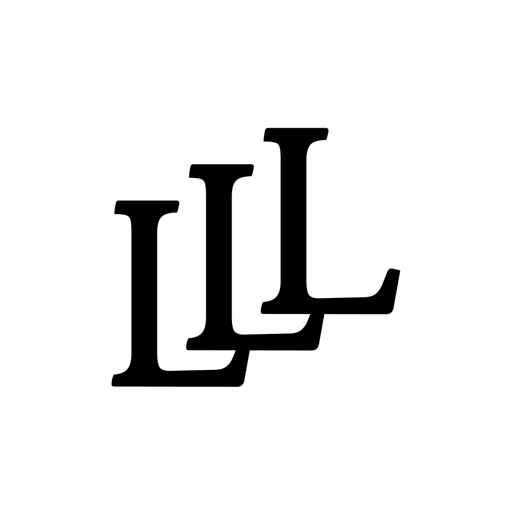
</p>

<h1 align="center">Lucky Lat·Lang</h1>
<p align="center">Personal astrocartography — discover the places on Earth that resonate with your birth chart.</p>

<p align="center">
  
  
  
  
  
  
</p>

---

## What it does

Lucky Lat·Lang takes your birth date, time, and place — and draws your **astrocartography map**: the planetary lines that trace where specific energies from your birth chart are strongest on Earth.

Enter your details once. The app computes planetary positions using Meeus orbital mechanics (with **Lahiri ayanamsha sidereal conversion** for Vedic accuracy), overlays all four line types (Rising / Setting / MC / IC) per planet on a live world map, and scores every major city as **lucky**, **neutral**, or **challenging** for you personally.

Tap any city to get a detailed breakdown — per-planet interpretation, natal sign, strength bar, and constellation imagery. Export the full reading as a formatted PDF.

## Features

### Core
- **Astrocartography lines** — Rising, setting, MC, and IC lines for 9 planets (Sun → Neptune)
- **Sidereal natal chart** — Vedic whole-sign houses with Lahiri ayanamsha; functional benefic/malefic classification per ascendant
- **170,000+ cities** — Scored from a bundled SQLite database (GeoNames `cities1000`, population ≥ 1,000, 252 countries)
- **City detail panel** — Google Maps–style draggable bottom sheet with per-planet interpretation, natal sign chip, and strength bar
- **Offline-first** — No backend, no account. All computation and city lookup runs on-device

### Navigation & UI
- **Multiple profiles** — Save every birth chart; switch between them from the side drawer
- **Country filter** — Focus the city list on any of 252 countries
- **Planet line toggles** — Show or hide individual planets from the side drawer
- **Internet status banner** — Inline "Disconnected" indicator on the map screen
- **About screen** — Astrocartography explainer with a randomly picked mystic polaroid

### Export
- **PDF report** — Natal chart table, planetary profile with sign constellation imagery, top lucky / challenging cities with planetary interpretations
- **File naming** — `luckylatlang_<name>_<yyyyMMdd_HHmm>.pdf`

### Home Screen Widget (Android)
- Three style variants: **Coral** (brand orange), **Dark** (black), **Material You** (system dynamic colors)
- Displays a random quote from fortune-mod (fetched from GitHub, cached locally)
- Paired with a random goth-art image on the right; tap to cycle both with a 400 ms fade
- No app launch on tap — pure widget interaction

## Screenshots

<table>
  <tr>
    <td align="center">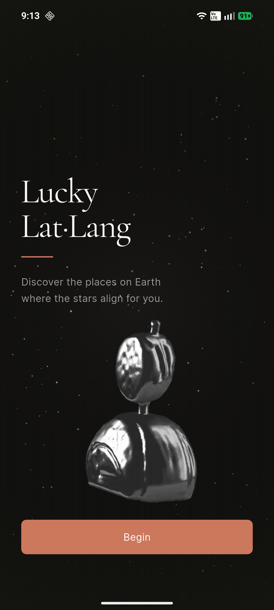<br/><sub>Intro</sub></td>
    <td align="center">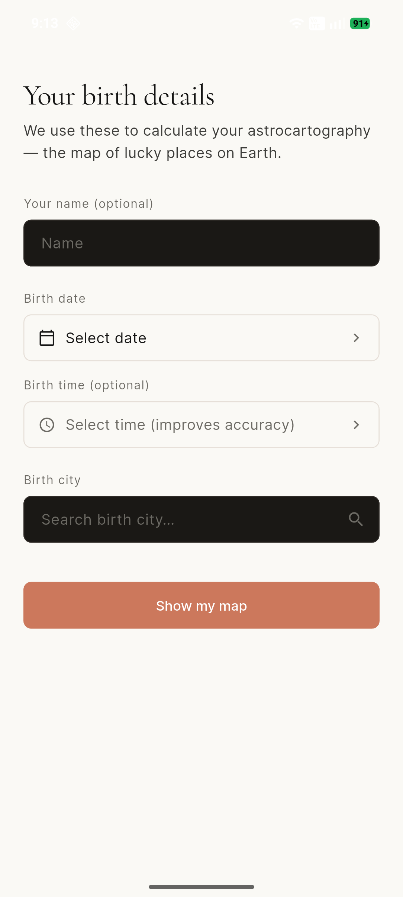<br/><sub>New profile</sub></td>
    <td align="center">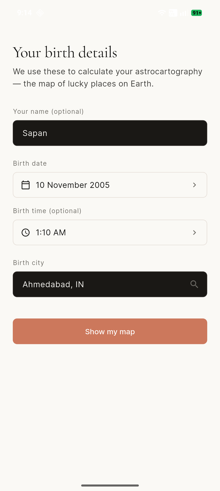<br/><sub>Profile filled</sub></td>
    <td align="center">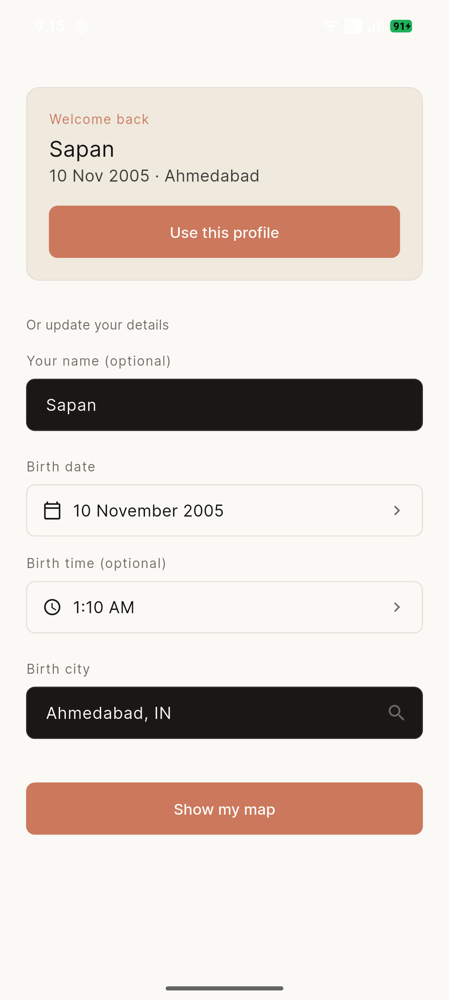<br/><sub>Saved profiles</sub></td>
  </tr>
  <tr>
    <td align="center">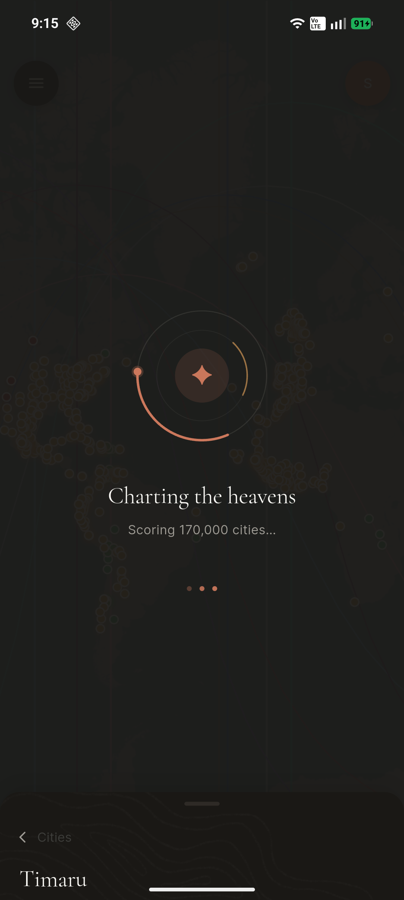<br/><sub>Computing lines</sub></td>
    <td align="center">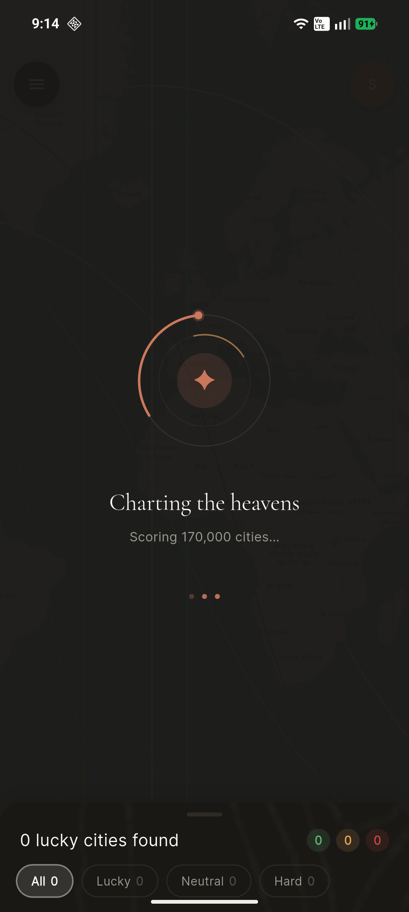<br/><sub>Map loading</sub></td>
    <td align="center">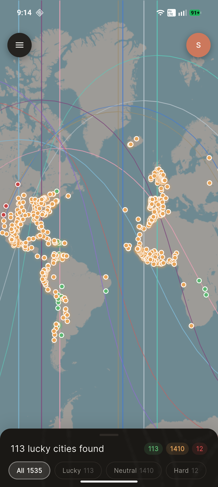<br/><sub>Map — planetary lines</sub></td>
    <td align="center">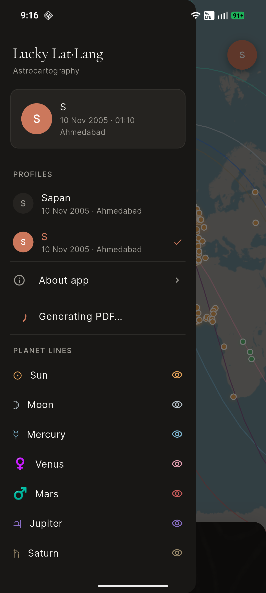<br/><sub>Drawer — planet toggles</sub></td>
  </tr>
  <tr>
    <td align="center">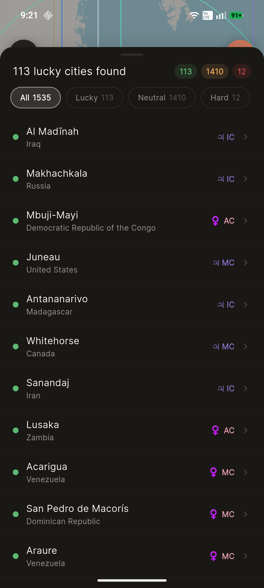<br/><sub>City list</sub></td>
    <td align="center">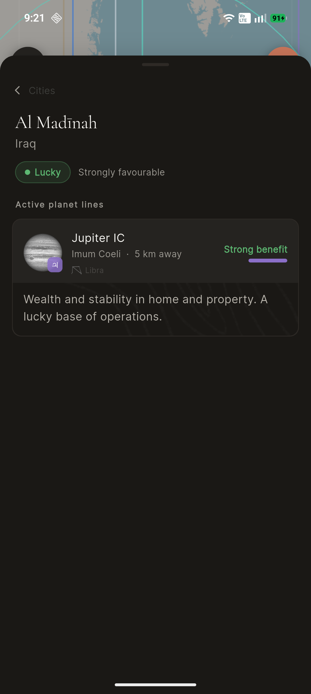<br/><sub>City detail — positive</sub></td>
    <td align="center">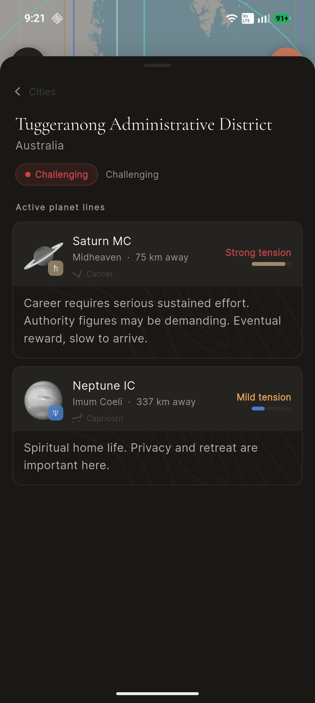<br/><sub>City detail — challenging</sub></td>
    <td align="center">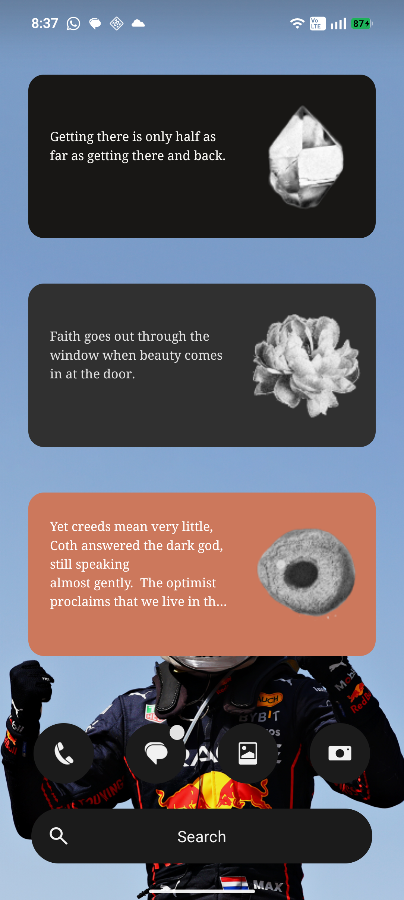<br/><sub>Home screen widgets</sub></td>
  </tr>
  <tr>
    <td align="center">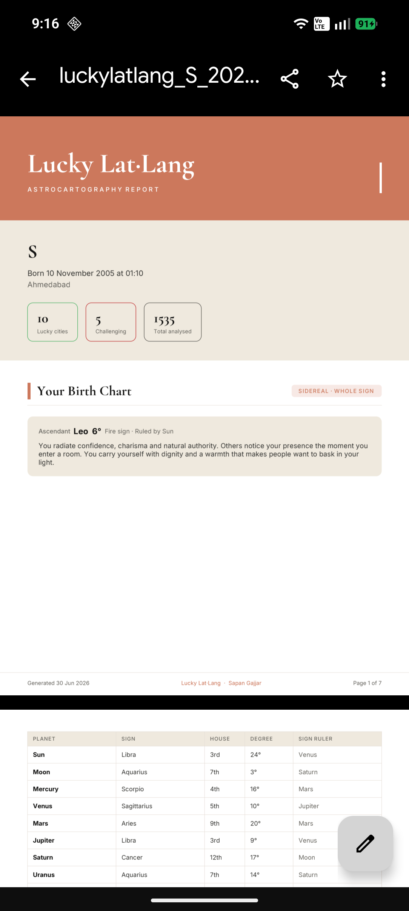<br/><sub>PDF report — cover</sub></td>
    <td align="center">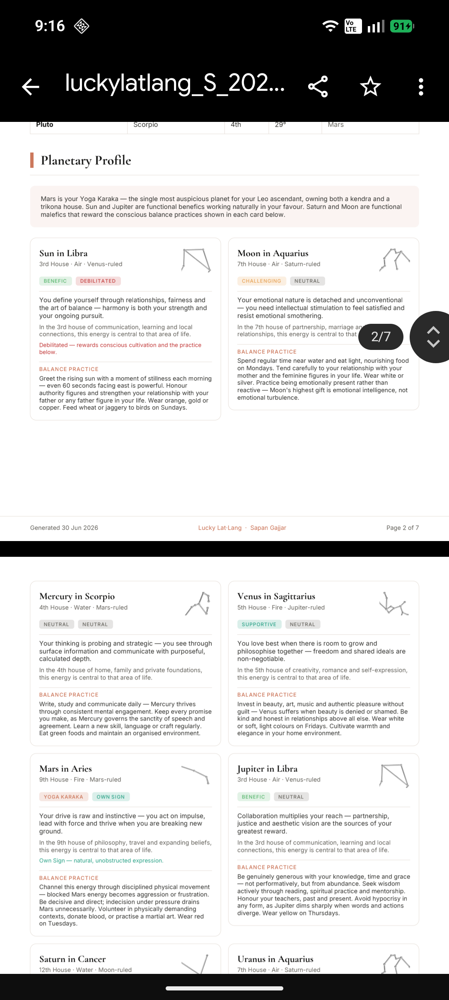<br/><sub>PDF report — natal chart</sub></td>
    <td align="center">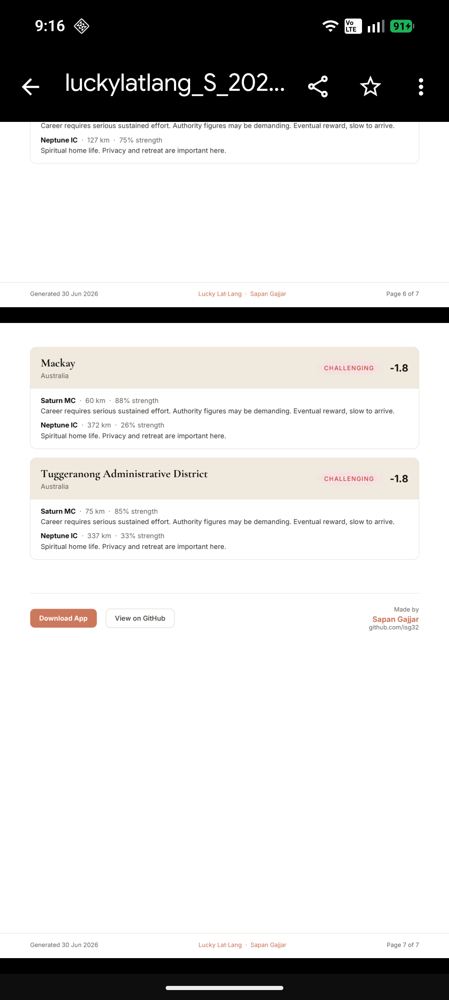<br/><sub>PDF report — cities</sub></td>
    <td align="center">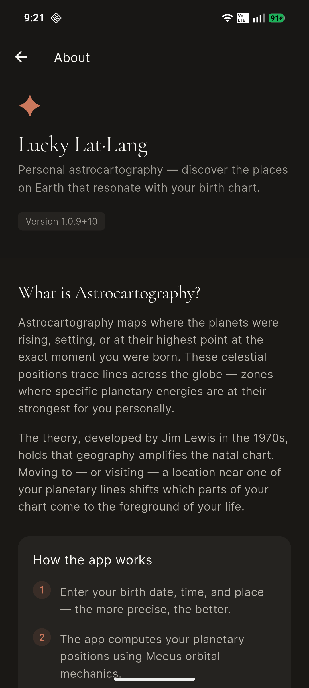<br/><sub>About</sub></td>
  </tr>
  <tr>
    <td align="center">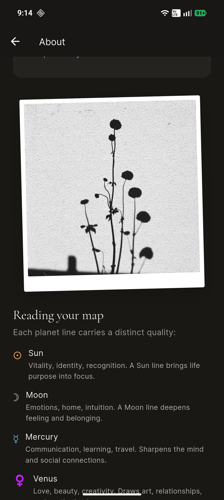<br/><sub>About — mystic</sub></td>
    <td align="center">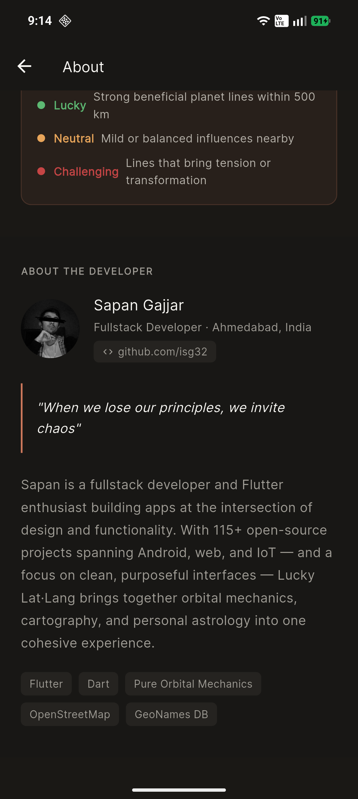<br/><sub>About — developer</sub></td>
    <td></td>
    <td></td>
  </tr>
</table>

## How it works

1. **Enter birth details** — date, time (optional but improves accuracy), and birth city
2. **Orbital mechanics** — Meeus algorithms compute ecliptic longitudes; Lahiri ayanamsha converts to sidereal; whole-sign house system assigns houses
3. **Line projection** — four great-circle arcs per planet (rising / setting / MC / IC) traced across the globe
4. **City scoring** — cities within 500 km of a line are scored by proximity and the planet's functional nature for this ascendant; < 200 km = strong, 200–500 km = moderate
5. **Explore** — tap any marker or blank spot on the map for a full breakdown; export the reading as PDF

## Tech stack

| Layer | Choice |
|---|---|
| Framework | Flutter 3.x |
| State management | Riverpod (`Provider`, `FutureProvider`, `StateProvider`, `NotifierProvider`) |
| Navigation | go_router |
| Map | flutter_map (OpenStreetMap tiles) |
| Astro computation | Pure Dart Meeus orbital mechanics + Lahiri ayanamsha |
| City database | SQLite via sqflite — 19 MB, 170,050 cities |
| Local storage | shared_preferences (profiles + quotes cache) |
| PDF | `pdf` + `printing` + `share_plus` |
| Fonts | Cormorant Garamond (display) + Inter (body) via google_fonts |
| Android widget | Native AppWidget (Kotlin) — RemoteViews + ViewFlipper |
| Android Gradle Plugin | 8.11.1 |
| Kotlin | 2.2.20 |

## Getting started

### Prerequisites

- Flutter SDK ≥ 3.12
- Android SDK (API 21+)
- A connected Android device or emulator

### Run

```bash
flutter pub get
flutter run
```

### Build

```bash
# Debug APK
flutter build apk

# Release APKs (split by ABI — outputs luckylatlang_<arch>_<datetime>-signed.apk)
flutter build apk --split-per-abi --release

# Single fat release APK (outputs luckylatlang_universal_<datetime>-signed.apk)
flutter build apk --release
```

### Lint & test

```bash
flutter analyze
flutter test
```

### Regenerate city database

```bash
python3 tools/generate_city_db.py
```

### Regenerate app icons

```bash
dart run flutter_launcher_icons
```

## Architecture

```
lib/
  main.dart                   # ProviderScope + SharedPreferences init
  core/
    theme/                    # AppTheme, AppColors, AppTextStyles
    router/                   # go_router route definitions
    storage/                  # ProfileStorage (multi-profile list + active id)
    db/                       # CityDb (SQLite wrapper)
  data/
    fortunes.dart             # Seed quotes for widget fallback
  features/
    intro/                    # Splash / intro screen (random animated cutout)
    profile/                  # Birth details form + birth-place search
    map/                      # World map + overlays + bottom sheet + side drawer
    about/                    # App explainer + developer section
    report/                   # PDF generation + share
  models/                     # BirthProfile, PlanetLine, CitySpot, NatalChart
  providers/                  # profileProvider, astroProvider, natalChartProvider, cityProvider
  services/
    astro_service.dart        # Meeus orbital mechanics + Lahiri ayanamsha
    city_service.dart         # City scoring from SQLite
    natal_interpretations.dart# Per-planet sign text, remedies, dignity tables

android/app/src/main/kotlin/…/
  FortuneWidgetProvider.kt    # Home screen widget (3 subclasses: Dark / Coral / Material)
```

**State flow:** `BirthProfile` → `astroResultProvider` (planet lines) + `natalChartProvider` (synchronous natal chart) → `cityProvider` (scores cities) → map renders lines + markers.

**APK naming:** Release builds output as `luckylatlang_<arch>_<yyyyMMdd_HHmm>-signed.apk` via `applicationVariants.all` in `app/build.gradle.kts`. The datetime is stamped at Gradle configuration time.

## Design

The app follows a warm editorial design system — cream canvas (`#faf9f5`), coral primary (`#cc785c`), dark surface (`#181715`). Topographic textures from the asset library appear as subtle backgrounds in the bottom sheet and city detail cards. Full token reference: [`design.md`](design.md).

## Assets & credits

Visual assets across the app are sourced from **[@costarastrology](https://github.com/costarastrology)**:

| Asset folder | Used in |
|---|---|
| `assets/animated/` | Intro screen — random cutout on every launch |
| `assets/goth/` | Home screen widget — paired with each quote |
| `assets/mystic/` | About screen — polaroid before "Reading your map" |
| `assets/planets/` | City detail panel — planet image with glyph badge |
| `assets/signs/` | PDF report planet cards + city detail sign chip |
| `assets/topography/` | Bottom sheet texture + city interpretation background |
| `assets/body/` | (Reserved) |

All commits using these assets include:
```
Co-Authored-By: costarastrology <costarastrology@users.noreply.github.com>
```

## License

This project is licensed under the **GNU General Public License v3.0** — see [`LICENSE`](LICENSE) for the full text.

In short: you are free to use, modify, and distribute this software, but any distributed version (modified or not) must also be released under GPL v3 with source code available.

Visual assets in `assets/animated/`, `assets/goth/`, `assets/mystic/`, `assets/planets/`, `assets/signs/`, `assets/topography/`, and `assets/body/` are by [@costarastrology](https://github.com/costarastrology) and retain their original terms.

City data is from [GeoNames](https://www.geonames.org/) under [CC BY 4.0](https://creativecommons.org/licenses/by/4.0/).

## City data

City database built from [GeoNames](https://www.geonames.org/) `cities1000` — all cities with population ≥ 1,000 worldwide (170,050 cities, 252 countries). Licensed under [CC BY 4.0](https://creativecommons.org/licenses/by/4.0/).

## Developer

Made by [Sapan Gajjar](https://github.com/isg32) — Fullstack Developer, Ahmedabad, India.

> "When we lose our principles, we invite chaos."

115+ open-source projects spanning Android, web, and IoT. Lucky Lat·Lang brings together orbital mechanics, cartography, and personal astrology into one cohesive experience.

---

<p align="center">
  <sub>Built with Flutter · Powered by OpenStreetMap · Orbital mechanics via Meeus algorithms · City data from GeoNames · Art by <a href="https://github.com/costarastrology">costarastrology</a></sub>
</p>
